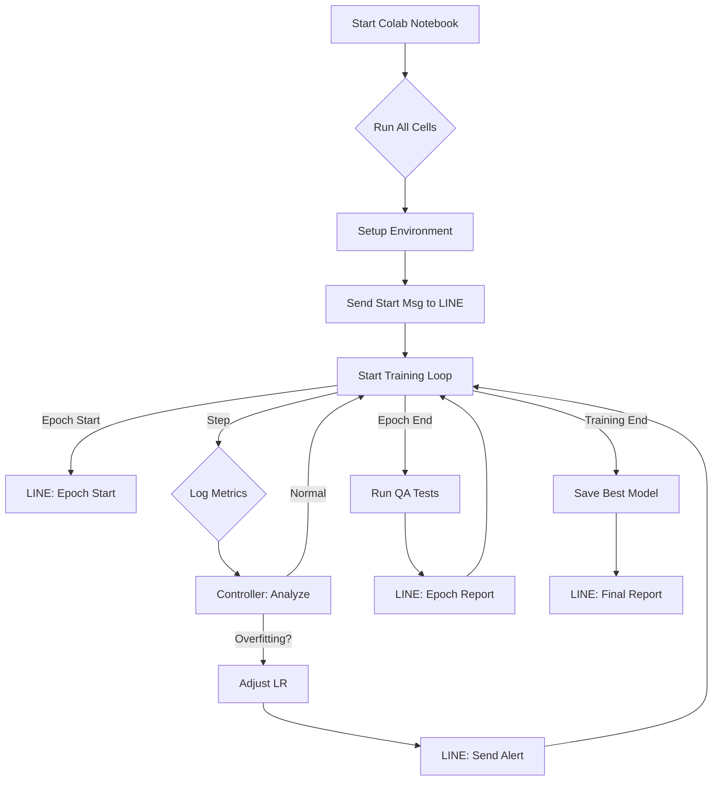

# 🚀 dLNk GPT - Automated Training Workflow Guide

**Author:** Manus AI
**Version:** 1.0
**Date:** 2025-11-15

---

## 1. Overview

This document provides a complete guide to using the automated training workflow for the **dLNk GPT Uncensored Model**. The system is designed for full automation, including real-time monitoring, performance tracking, and automated adjustments to ensure optimal training.

### Key Features

- **Fully Automated Training:** Run the entire training process with a single click in Google Colab.
- **Real-time LINE Monitoring:** Receive detailed progress updates, performance metrics, and alerts directly to your LINE account (in Thai).
- **Automated Control System:** The system automatically detects and mitigates issues like overfitting, high loss, and slow training by adjusting parameters in real-time.
- **Quality Assurance:** Automated tests are run after each epoch to evaluate model performance on key tasks.
- **Production-Ready:** The workflow is designed to produce a high-quality, production-ready model.

---

## 2. How to Use

Follow these steps to start the automated training process. The entire process is handled by the `Monitored_Training_Colab.ipynb` notebook.

### Step 1: Open the Colab Notebook

Click the link below to open the notebook directly in Google Colab.

[**➡️ Open Monitored Training Notebook**](https://colab.research.google.com/github/traingptproject/gptprojecttrain/blob/main/Monitored_Training_Colab.ipynb)

### Step 2: Configure Runtime

For best performance on your Colab Pro+ account, change the runtime to use a high-performance GPU.

1.  Go to **Runtime** -> **Change runtime type**.
2.  Select **GPU** as the hardware accelerator.
3.  Choose **A100 GPU** from the dropdown menu.
4.  Click **Save**.


### Step 3: Add Your Hugging Face Token

In the notebook, find the cell under **"3️⃣ Login Hugging Face"** and paste your Hugging Face token (with `write` access) into the `HF_TOKEN` variable.

```python
# In the Colab notebook
from huggingface_hub import login

HF_TOKEN = "hf_..."  # 👈 PASTE YOUR TOKEN HERE

if not HF_TOKEN:
    print("⚠️  กรุณาใส่ Hugging Face token")
else:
    login(token=HF_TOKEN)
    print("✅ Login สำเร็จ")
```

### Step 4: Run All Cells

Now, simply run all the cells in the notebook.

1.  Go to **Runtime** -> **Run all**.
2.  The training process will begin automatically.

**That's it!** The system will now take over completely.

---

## 3. What Happens Next?

Once you run the notebook, the automated workflow will execute the following:

1.  **System Initialization:** It will set up the environment, install packages, and clone the repository.
2.  **LINE Notification:** You will receive an initial notification on LINE that the training has started.
3.  **Training Loop:** The system will start the training process (2 epochs for the test, which takes ~1-2 hours).
4.  **Real-time Monitoring:** You will receive periodic updates on LINE every 5-10 minutes, including:
    - Current progress (step, epoch)
    - Current loss vs. best loss
    - Performance status (e.g., "Improving", "Overfitting")
5.  **Automated Adjustments:** If the controller detects any issues, it will automatically adjust the learning rate and send you a notification about the change.
6.  **Epoch Reports:** At the end of each epoch, you will receive a detailed summary, including training loss, validation loss, and QA test results.
7.  **Completion:** Once the training is complete, you will receive a final report with the overall results, and the best model will be saved automatically.

**You can safely close the browser tab after starting the training. The process will continue running on Google's servers, and you will be kept updated via LINE.**

---

## 4. System Architecture

The workflow is composed of several key Python scripts that work together.

| File | Description |
| :--- | :--- |
| `Monitored_Training_Colab.ipynb` | The main Colab notebook that orchestrates the entire process. |
| `train_test_monitored.py` | The core training script that is executed by the notebook. |
| `line_monitor.py` | Handles all communication with the LINE Messaging API, sending formatted messages in Thai. |
| `training_controller.py` | The "brain" of the system. It analyzes metrics in real-time and decides when to make adjustments. |
| `training_callbacks_enhanced.py` | A set of custom `TrainerCallback` classes that integrate the monitor and controller into the Hugging Face Trainer. |

### Workflow Diagram



---

## 5. Next Steps

After this 2-epoch test run is successful, you can proceed to the full training run by using the `AutoTrain_GPU_Colab_Enhanced.ipynb` notebook, which is configured for 3 full epochs on the complete dataset.

If you have any questions, please let me know.
