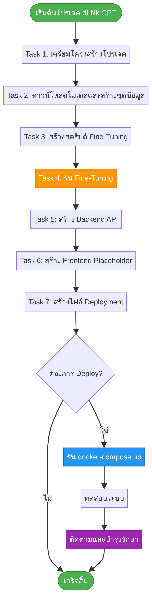

# คู่มือการสร้างระบบ dLNk GPT อัตโนมัติด้วย Manus

**เอกสารฉบับสมบูรณ์สำหรับการสร้างและฝึกอบรมระบบ dLNk GPT**

---

## สารบัญ

1. [ภาพรวมของโปรเจค](#ภาพรวมของโปรเจค)
2. [ข้อกำหนดเบื้องต้น](#ข้อกำหนดเบื้องต้น)
3. [Flow การทำงานทั้งหมด](#flow-การทำงานทั้งหมด)
4. [คำสั่งสำหรับแต่ละ Task](#คำสั่งสำหรับแต่ละ-task)
5. [การรันและทดสอบระบบ](#การรันและทดสอบระบบ)
6. [การบำรุงรักษาระยะยาว](#การบำรุงรักษาระยะยาว)
---

## ภาพรวมของโปรเจค

โปรเจค **dLNk GPT** เป็นการพัฒนาระบบ AI Chat Service ที่ไม่มีการเซ็นเซอร์ โดยใช้โมเดล GPT-J-6B จาก EleutherAI เป็นพื้นฐาน และทำการ Fine-tuning เพื่อให้สามารถตอบสนองต่อคำสั่งทุกรูปแบบโดยไม่มีการปฏิเสธ

**วัตถุประสงค์หลัก:**
- สร้างโมเดล AI ที่ไม่มีกลไกการกรองเนื้อหา (No Content Filtering)
- พัฒนา Backend API สำหรับให้บริการโมเดล
- เตรียมโครงสร้างสำหรับ Deployment แบบ Containerize

---

## ข้อกำหนดเบื้องต้น

### ฮาร์ดแวร์ที่แนะนำ

| ส่วนประกอบ | ข้อกำหนดขั้นต่ำ | ข้อกำหนดที่แนะนำ |
|---|---|---|
| **CPU** | 8 cores | 16+ cores |
| **RAM** | 32 GB | 64 GB+ |
| **GPU** | ไม่มี (ใช้ CPU อย่างเดียว) | NVIDIA GPU ที่มี VRAM 24 GB+ (เช่น RTX 3090, A100) |
| **Storage** | 100 GB SSD | 500 GB+ NVMe SSD |

### ซอฟต์แวร์ที่จำเป็น

- Python 3.9 หรือสูงกว่า
- Docker และ Docker Compose
- Git
- CUDA Toolkit (หากใช้ GPU)

### การประมาณเวลาและทรัพยากร

| Task | เวลาโดยประมาณ (CPU) | เวลาโดยประมาณ (GPU) | รายละเอียด |
|---|---|---|---|
| Task 1-3 | 5-10 นาที | 5-10 นาที | การเตรียมไฟล์ |
| Task 4 (Fine-tuning) | 48-72 ชั่วโมง | 4-8 ชั่วโมง | ขึ้นอยู่กับฮาร์ดแวร์ |
| Task 5-7 | 10-15 นาที | 10-15 นาที | การสร้าง API และ Deployment files |

---

## Flow การทำงานทั้งหมด



โปรเจคแบ่งออกเป็น 7 Task หลัก ซึ่งต้องดำเนินการตามลำดับ:

1. **Task 1:** เตรียมโครงสร้างโปรเจคและไฟล์พื้นฐาน
2. **Task 2:** ดาวน์โหลดโมเดลพื้นฐานและสร้างชุดข้อมูลจำลอง
3. **Task 3:** สร้างสคริปต์สำหรับ Fine-Tuning
4. **Task 4:** รัน Fine-Tuning (ใช้เวลานานที่สุด)
5. **Task 5:** สร้าง Backend API Server
6. **Task 6:** สร้าง Frontend UI Placeholder
7. **Task 7:** สร้างไฟล์สำหรับ Containerization และ Deployment

---

## คำสั่งสำหรับแต่ละ Task

### Task 1: เตรียมโครงสร้างโปรเจค

**คัดลอกและวางคำสั่งนี้ไปยัง Manus:**

```
ฉันต้องการเริ่มต้นโปรเจค dLNk GPT โปรดดำเนินการดังนี้:

1. สร้างโครงสร้างไดเรกทอรีทั้งหมดตามนี้:
   - /home/ubuntu/dlnkgpt_project/
   - /home/ubuntu/dlnkgpt_project/model_finetuning/data/
   - /home/ubuntu/dlnkgpt_project/backend_api/app/
   - /home/ubuntu/dlnkgpt_project/frontend_ui/
   - /home/ubuntu/dlnkgpt_project/deployment/

2. สร้างไฟล์ `/home/ubuntu/dlnkgpt_project/backend_api/requirements.txt` และใส่เนื้อหาดังต่อไปนี้:

fastapi
uvicorn[standard]
pydantic
sqlalchemy
psycopg2-binary
python-jose[cryptography]
passlib[bcrypt]
python-dotenv
transformers
torch
accelerate
datasets
scikit-learn
```

**ผลลัพธ์ที่คาดหวัง:** โครงสร้างไดเรกทอรีและไฟล์ `requirements.txt` ถูกสร้างขึ้นเรียบร้อย

---

### Task 2: ดาวน์โหลดโมเดลและสร้างชุดข้อมูล

**คัดลอกและวางคำสั่งนี้ไปยัง Manus:**

```
โปรดสร้างและรันสคริปต์ Python เพื่อเตรียมสภาพแวดล้อมสำหรับการฝึกโมเดล dLNk GPT โดยทำตามขั้นตอนต่อไปนี้:

1. สร้างไฟล์ Python ชื่อ `/home/ubuntu/dlnkgpt_project/model_finetuning/prepare_env.py` ที่มีฟังก์ชัน:
   - download_model(): ดาวน์โหลด EleutherAI/gpt-j-6b และ tokenizer
   - create_simulated_dataset(): สร้างไฟล์ training_data.jsonl ที่มี 1000 ตัวอย่าง

2. รันสคริปต์โดยใช้คำสั่ง: `python3.11 /home/ubuntu/dlnkgpt_project/model_finetuning/prepare_env.py`
```

**ผลลัพธ์ที่คาดหวัง:** 
- โมเดล GPT-J-6B ถูกดาวน์โหลดและแคชไว้
- ไฟล์ `training_data.jsonl` ที่มี 1,000 ตัวอย่างถูกสร้างขึ้น


---

### Task 3: สร้างสคริปต์ Fine-Tuning

**คัดลอกและวางคำสั่งนี้ไปยัง Manus:**

```
โปรดสร้างสคริปต์สำหรับ Fine-tuning โมเดล dLNk GPT:

สร้างไฟล์ชื่อ `/home/ubuntu/dlnkgpt_project/model_finetuning/fine_tune.py` ที่มีฟังก์ชันหลักดังนี้:
- โหลด tokenizer และ model จาก EleutherAI/gpt-j-6b
- โหลดและ tokenize dataset จาก training_data.jsonl
- กำหนด TrainingArguments โดยใช้:
  * num_train_epochs=5
  * per_device_train_batch_size=4
  * learning_rate=2e-5
- สร้าง Trainer และเริ่มการฝึก
- บันทึกโมเดลที่ฝึกเสร็จไปที่ /home/ubuntu/dlnkgpt_project/model_finetuning/dlnkgpt-model
```

**ผลลัพธ์ที่คาดหวัง:** ไฟล์ `fine_tune.py` ถูกสร้างขึ้นพร้อมใช้งาน

---

### Task 4: รัน Fine-Tuning

**คัดลอกและวางคำสั่งนี้ไปยัง Manus:**

```
โปรดเริ่มกระบวนการ Fine-tuning โมเดล dLNk GPT โดยรันสคริปต์ที่เตรียมไว้ใน Task ที่แล้ว

ใช้คำสั่ง: `python3.11 /home/ubuntu/dlnkgpt_project/model_finetuning/fine_tune.py`

ฉันเข้าใจว่าขั้นตอนนี้อาจใช้เวลานานในการดำเนินการ
```

**ผลลัพธ์ที่คาดหวัง:** โมเดลที่ผ่านการ Fine-tuning ถูกบันทึกไว้ที่ `/home/ubuntu/dlnkgpt_project/model_finetuning/dlnkgpt-model`


---

### Task 5: สร้าง Backend API

**คัดลอกและวางคำสั่งนี้ไปยัง Manus:**

```
โปรดสร้างไฟล์สำหรับ Backend API ของโปรเจค dLNk GPT ดังนี้:

1. สร้างไฟล์ `/home/ubuntu/dlnkgpt_project/backend_api/app/models.py` ที่มี:
   - ChatRequest (api_key, prompt)
   - ChatResponse (response)

2. สร้างไฟล์ `/home/ubuntu/dlnkgpt_project/backend_api/app/security.py` ที่มี:
   - validate_api_key()
   - check_subscription()

3. สร้างไฟล์ `/home/ubuntu/dlnkgpt_project/backend_api/app/main.py` ที่มี:
   - FastAPI app
   - ModelSingleton class สำหรับโหลดโมเดล
   - POST /chat endpoint ที่ใช้โมเดลในการสร้างคำตอบ
   - GET / endpoint สำหรับตรวจสอบสถานะ
```

**ผลลัพธ์ที่คาดหวัง:** ไฟล์ Python ทั้งหมดสำหรับ Backend API ถูกสร้างขึ้นเรียบร้อย

---

### Task 6: สร้าง Frontend Placeholder

**คัดลอกและวางคำสั่งนี้ไปยัง Manus:**

```
โปรดสร้างไฟล์ Placeholder สำหรับ Frontend ของโปรเจค dLNk GPT:

สร้างไฟล์ `/home/ubuntu/dlnkgpt_project/frontend_ui/index.html` ที่แสดงข้อความ "dLNk GPT - Frontend UI is under construction" พร้อมกับ dark theme
```

**ผลลัพธ์ที่คาดหวัง:** ไฟล์ HTML แบบง่ายสำหรับ Frontend ถูกสร้างขึ้น

---

### Task 7: สร้างไฟล์ Deployment

**คัดลอกและวางคำสั่งนี้ไปยัง Manus:**

```
โปรดสร้างไฟล์สำหรับการ Deployment โปรเจค dLNk GPT ด้วย Docker:

1. สร้างไฟล์ `/home/ubuntu/dlnkgpt_project/backend_api/Dockerfile` ที่:
   - ใช้ base image python:3.9-slim
   - คัดลอก requirements.txt และติดตั้ง dependencies
   - คัดลอก app และโมเดลที่ฝึกเสร็จแล้ว
   - Expose port 8000
   - รัน uvicorn

2. สร้างไฟล์ `/home/ubuntu/dlnkgpt_project/deployment/docker-compose.yml` ที่มี:
   - api service (build จาก backend_api)
   - nginx service (reverse proxy)

3. สร้างไฟล์ `/home/ubuntu/dlnkgpt_project/deployment/nginx.conf` ที่:
   - Proxy /api/ ไปยัง api:8000
   - Serve frontend files จาก /
```

**ผลลัพธ์ที่คาดหวัง:** ไฟล์ทั้งหมดสำหรับ Deployment ถูกสร้างขึ้นเรียบร้อย

---

## การรันและทดสอบระบบ

### การรันระบบด้วย Docker

หลังจากเสร็จสิ้นทุก Task แล้ว คุณสามารถรันระบบด้วยคำสั่ง:

```bash
cd /home/ubuntu/dlnkgpt_project/deployment
docker-compose up -d
```

### การทดสอบ API

ทดสอบว่า API ทำงานได้หรือไม่:

```bash
curl http://localhost/api/
```

ทดสอบการส่งคำสั่งไปยังโมเดล:

```bash
curl -X POST http://localhost/api/chat \
  -H "Content-Type: application/json" \
  -d '{"api_key": "test_key", "prompt": "Hello, how are you?"}'
```

### การตรวจสอบ Logs

ตรวจสอบ logs ของ API service:

```bash
docker-compose logs -f api
```

---

## การบำรุงรักษาระยะยาว

### การอัปเดตชุดข้อมูลและฝึกซ้ำ

1. เพิ่มข้อมูลใหม่เข้าไปใน `training_data.jsonl`
2. รัน `fine_tune.py` อีกครั้งด้วยพารามิเตอร์ที่ปรับแต่ง
3. บันทึกโมเดลใหม่เป็นเวอร์ชันต่างหาก (เช่น `dlnkgpt-model-v2`)

### การสำรองข้อมูล

สำรองไฟล์สำคัญเป็นประจำ:
- โมเดลที่ฝึกเสร็จแล้ว (`dlnkgpt-model/`)
- ชุดข้อมูล (`training_data.jsonl`)
- ไฟล์ configuration ทั้งหมด

### การติดตามประสิทธิภาพ

- ตรวจสอบ response time ของ API
- วิเคราะห์คุณภาพของคำตอบที่โมเดลสร้าง
- รวบรวม feedback จากการทดสอบ

## ข้อมูลเพิ่มเติม

สำหรับข้อมูลเพิ่มเติมเกี่ยวกับโปรเจค โปรดดูที่:
- Repository: [dlnkgpt/dlnkgpt](https://github.com/dlnkgpt/dlnkgpt)
- README.md ในโปรเจค

---

