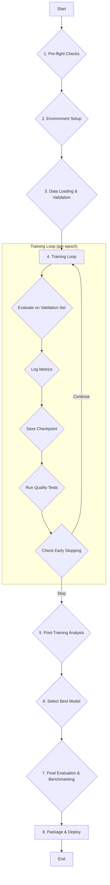

# dLNk GPT - Advanced Training Workflow Design

## 1. Workflow Overview

This document outlines a comprehensive, automated training workflow for the dLNk GPT model, designed for robustness, efficiency, and quality assurance. The workflow integrates advanced techniques for overfitting prevention, real-time monitoring, and automated decision-making.

**Key Goals:**
- **Maximize Model Performance:** Achieve the best possible results on the given dataset.
- **Prevent Overfitting:** Ensure the model generalizes well to new, unseen data.
- **Automate Decision Making:** Reduce manual intervention through intelligent systems like early stopping.
- **Ensure Reproducibility:** Guarantee consistent results with versioned code, data, and configurations.
- **Provide Deep Insights:** Offer real-time visibility into training dynamics through comprehensive monitoring.

### Workflow Diagram



## 2. Core Components & Implementation

### 2.1. Enhanced Training Script (`train_enhanced.py`)

This new script will replace the basic `fine_tune.py` and will be the core of the workflow. It will leverage the Hugging Face `Trainer` API, which provides a robust framework for implementing the required features.

**Key Features of `Trainer` to be used:**
- **Integrated Evaluation:** Automatically runs evaluation on a validation set during training.
- **Callbacks:** A powerful system for injecting custom logic at various points in the training loop.
- **Logging:** Seamless integration with TensorBoard and other logging platforms.
- **Checkpoint Management:** Sophisticated handling of model checkpoints.

### 2.2. Overfitting Prevention

#### a. Early Stopping
- **Implementation:** Use the `EarlyStoppingCallback` from the `transformers` library.
- **Configuration:**
    - `early_stopping_patience`: **3 epochs**. Stop training if the validation loss does not improve for 3 consecutive evaluation runs.
    - `early_stopping_threshold`: **0.001**. A minimum required improvement to be considered a real improvement.
- **Metric:** Monitor `eval_loss` (validation loss).

#### b. Learning Rate Scheduling
- **Implementation:** Use the `ReduceLROnPlateau` scheduler, integrated within the `Trainer`.
- **Configuration:**
    - `lr_scheduler_type`: `cosine` or `linear` with warmup.
    - `warmup_steps`: **500**. Gradually increase the learning rate for the first 500 steps to stabilize training.

#### c. Weight Decay
- **Implementation:** A standard `Trainer` argument.
- **Configuration:**
    - `weight_decay`: **0.01**. A small penalty applied to large weights to encourage the model to use a wider range of features.

### 2.3. Monitoring and Visualization

- **Implementation:** Natively supported by the `Trainer` API.
- **Tool:** **TensorBoard**.
- **Configuration:**
    - `logging_strategy`: `steps`
    - `logging_steps`: **10**. Log training loss and other metrics every 10 steps.
    - `evaluation_strategy`: `epoch`. Run a full evaluation on the validation set at the end of each epoch.
    - `report_to`: `tensorboard`.
- **Metrics to be Logged:**
    - `loss` (training loss)
    - `eval_loss` (validation loss)
    - `learning_rate`
    - `epoch`
    - `step`

### 2.4. Quality Assurance Pipeline

- **Implementation:** A custom `TrainerCallback` will be created (`QualityAssuranceCallback`).
- **Functionality:** At the end of each epoch (after evaluation), this callback will:
    1. **Load the latest checkpoint.**
    2. **Generate sample outputs** from a fixed set of test prompts.
    3. **Log the generated text** to a file and to the console.
    4. **(Future) Calculate metrics** like BLEU or ROUGE against reference answers.

**Test Prompts (examples):**
```python
qa_prompts = [
    "Explain the theory of relativity in simple terms.",
    "Write a Python function to calculate the factorial of a number.",
    "What are the main causes of climate change?"
]
```

### 2.5. Checkpoint Management

- **Implementation:** Handled by `TrainingArguments`.
- **Configuration:**
    - `output_dir`: `./training_output`
    - `save_strategy`: `epoch`. Save a checkpoint at the end of each epoch.
    - `save_total_limit`: **3**. Keep only the last 3 checkpoints to save disk space.
    - `load_best_model_at_end`: **True**. After training, automatically load the checkpoint with the lowest validation loss.

## 3. New & Modified Files

### a. `train_enhanced.py` (New)
This will be the main script. It will define and configure the `Trainer`, `TrainingArguments`, and all callbacks.

### b. `callbacks.py` (New)
This file will contain the custom `QualityAssuranceCallback`.

### c. `AutoTrain_GPU_Colab_Enhanced.ipynb` (New)
A new Colab notebook will be created to run the enhanced training workflow. It will:
1. Install dependencies.
2. Authenticate with Hugging Face.
3. Download and run `train_enhanced.py`.
4. Provide instructions for launching and monitoring with TensorBoard.

### d. `config.py` (New)
A centralized configuration file for all hyperparameters, paths, and settings to ensure reproducibility and ease of modification.

## 4. Step-by-Step Execution Plan in Colab

1. **Setup:**
   - User uploads `AutoTrain_GPU_Colab_Enhanced.ipynb` to Colab and enables GPU.
   - The notebook installs all necessary libraries (`transformers`, `datasets`, `accelerate`, `peft`, `tensorboard`).

2. **Configuration:**
   - The user enters their Hugging Face token.
   - All other configurations are loaded from the `config.py` file within the repository.

3. **Launch Training:**
   - The notebook executes the `train_enhanced.py` script.
   - The `Trainer` starts the training loop.

4. **Real-time Monitoring:**
   - The notebook will provide a command to launch **TensorBoard** directly within Colab.
   - The user can open the TensorBoard link to view live graphs of training loss, validation loss, and learning rate.

5. **Automated Actions:**
   - **During Training:** The `Trainer` will automatically log metrics, adjust the learning rate, and save checkpoints.
   - **Epoch End:** The `QualityAssuranceCallback` will generate and display sample outputs.
   - **Overfitting Detected:** The `EarlyStoppingCallback` will automatically end the training process if validation loss stops improving.

6. **Completion:**
   - When training completes (either by finishing all epochs or by early stopping), the `Trainer` will automatically load the weights from the best-performing checkpoint.
   - The final, best model is saved to the output directory, ready for deployment or upload to the Hugging Face Hub.

## 5. Benefits of this Workflow

- **Robustness:** The system can handle common training problems automatically.
- **Efficiency:** Early stopping prevents wasting time and compute resources on unproductive training.
- **Quality:** By loading the best model and performing QA checks, the final artifact is guaranteed to be the highest quality one produced.
- **Insightful:** Provides clear, real-time data on how the model is learning.
- **Reproducible:** All settings are version-controlled, ensuring anyone can reproduce the results.
